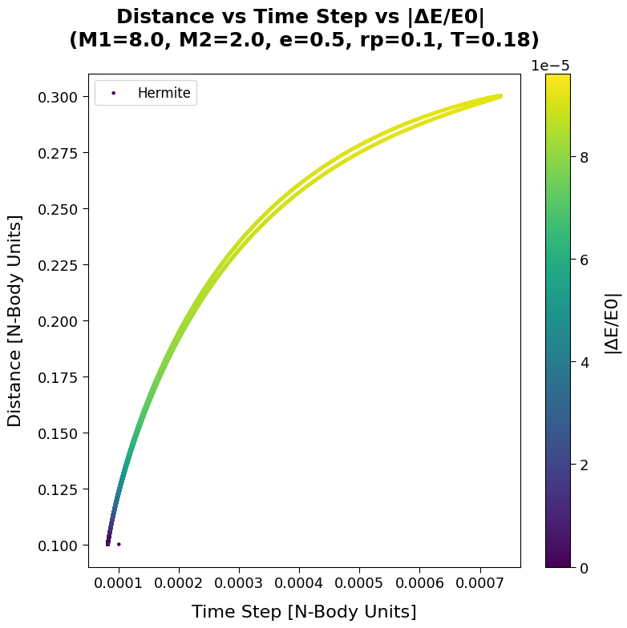

# Assignment 3: The Two-Body problem(s*)
## Group: I Miloncini

-  **C) "Let’s stay together, Circular orbit"    +    D) "Come closer, darling!, Eccentric orbits"**
  Scripts description:
	  - `ass3_all.py`: script used for the integration of the systems without the adaptive timestep and softening;
	  - `ass3_all_tstep.py`: script used for the integration of the systems with the adaptive timestep and softening;
	  - `ass3_all_plots.py`: script used to produce the plots from which we selected those submitted.
*Note*: In the analysis of the tests performed we will consider the TSUNAMI integrator as our ground truth.
These are the setting used in the tests:
	- $e=0.0$, $rp=0.1$
	- $e=0.0$, $rp=1.0$
	- $e=0.5$, $rp=0.1$
	- $e=0.5$, $rp=1.0$
We choose the following timesteps: $0.00001$, $0.0001$, $0.001$.
	- $e=0.9$, $rp=0.1$
	- $e=0.99$, $rp=0.1$
With these value of the eccentricity we opted for using only a value of $rp=0.1$ and timesteps of $0.0001$, $0.001$, $0.01$ due to runtime and resources reasons. Nevertheless, these initial conditions can lead to valid conclusions.

Regarding the simulation without the adaptive timestep, we can conclude that all the integrators performed 
according to theoretical expectations and the choice of the above mentioned timesteps helped evolving the 
systems in the correct way. Symplecticity is maintained by the integrators that in theory are (modified Euler 
and Leapfrog (or Verlet)). While the others stay non-symplectic. Overall the 4$^{th}$ order Runge-Kutta 
integrator, with its four force estimations, is the closest one to the TSUNAMI integrator. For systems with 
$e=0.0$, $e=0.5$, the choice of $h=0.00001$, $h=0.0001$ is effective. $h=0.001$ is already a more borderline 
case, and in systems with extreme eccentricity it makes correct integration of the equations difficult. 
Similarly, $h=0.01$ is also totally ineffective.

The use of adaptive timestep and softening greatly aids systems integration. There remain some cases where, at 
the same timestep with other integrators, integration is not effective. This is because we used a single 
configuration: $\eta = 0.01$ for the adaptive timestep, softening of $10^{-4}$; so probably for certain 
integrators a finetuning of the parameters had to be performed to achieve the best performance. In general, on 
average, there was a 90% reduction in integration steps, still completing the evolution for the predetermined 
time of $10 \cdot T_{period}$ .

From the theory we expect adaptive timesteps, indeed self-adjusting: small timesteps when the two bodies are 
very close and closer integrations of the system state are needed for the orbital evolution to be the correct 
one; larger timesteps when the two bodies are far apart and the mutual interaction is less preponderant. That is 
what we can see in this graph, for illustrative use. On the x-axis we have the timestep values, on the y-axis we 
have the value of the Euclidean distance between the two bodies, and the color indicates the relative energy 
error, on a scale of $10^{-4}$. When the distance between the two bodies is small, the timestep is small; as the 
distance increases, the timestep also increases. With small timesteps, evolution maintains an error on the 
energy small, while at larger distances the integrator "can afford" to make somewhat larger errors on the 
energy, while still integrating the orbits correctly when the two bodies are further apart.
